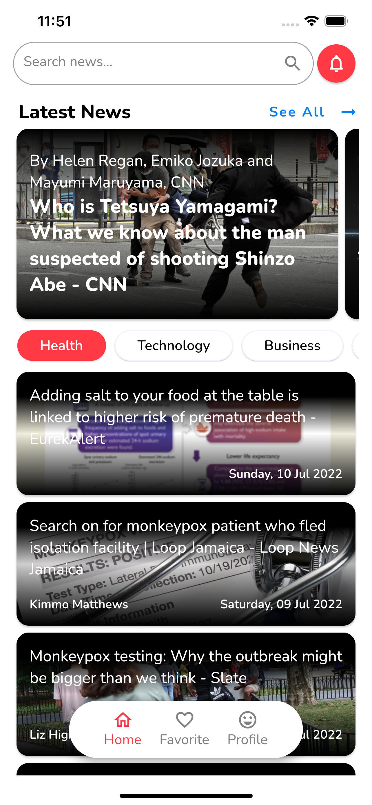
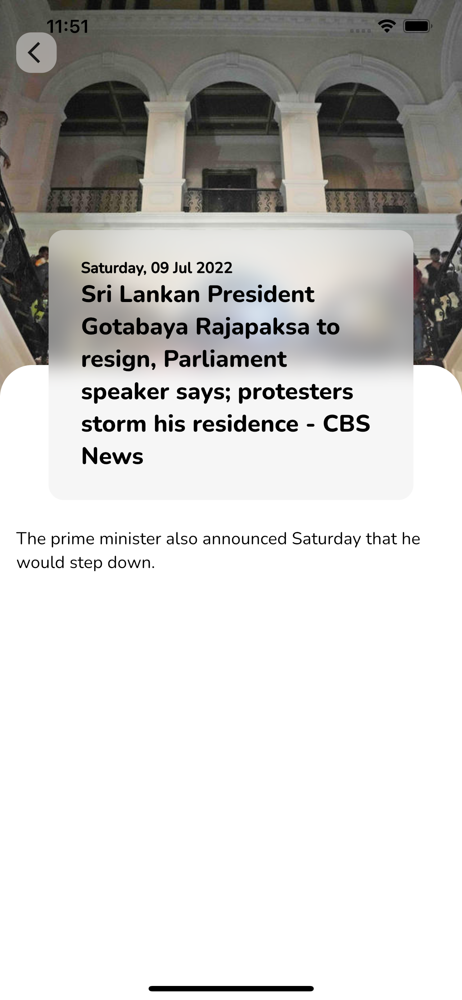
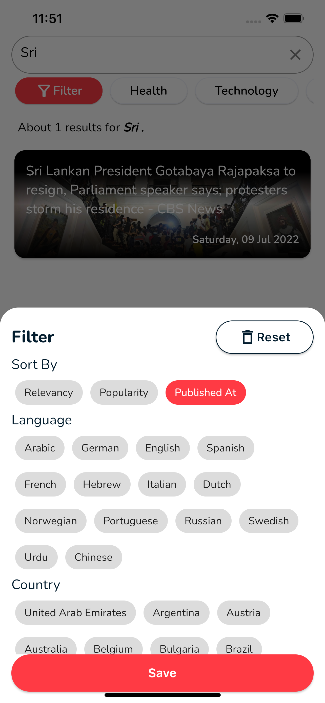

##  Fintechnology Asia Pacific Lanka (Pvt) Ltd Flutter Test

### Screenshots
&nbsp;
&nbsp;
&nbsp;
&nbsp;

## Android Video

## IOS Video

## How to Run

Flutter Version : `3.0.1`  
Dart Version    : `2.17.1` 

### Run app in `dev` environment
<pre>flutter run -t lib/main_dev.dart  --flavor=dev </pre>
### Run app in debug mode (Picks up debug signing config)
<pre>flutter run -t lib/main_dev.dart  --debug --flavor=dev </pre>
### Run app in release mode (Picks up release signing config)
<pre>flutter run -t lib/main_dev.dart  --release --flavor=dev </pre>
### Create appBundle for Android platform. Runs in release mode by default.
<pre>flutter build appbundle -t lib/main_dev.dart  --flavor=dev </pre>
### Create APK for dev flavor. Runs in release mode by default.
<pre>flutter build apk -t lib/main_dev.dart  --flavor=dev </pre>
